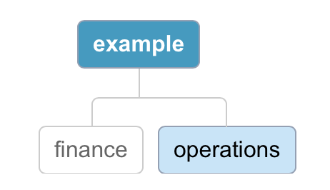
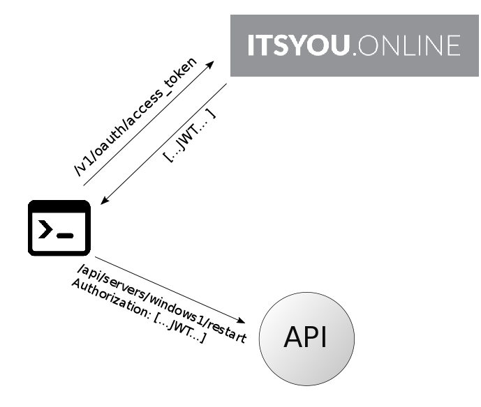

# Securing an api using ItsYou.online

It's easy to use ItsYou.online to implement authentication and authorization to secure your api's.

Let's create a service that exposes an api to restart servers.

```
POST /api/servers/{machineid}/restart
```

Off course, not everyone is allowed to just restart servers and we also want to log who restarted a server.

Let's assume the following organization structure:



In our case, we only want to allow people from the operations department to restart servers.
Say Bob, member of the operations department, wrote a script to restart all the servers. The script needs to prove to the server restarting service that it is being executed by Bob, member of the operations department and not by Alice, who works at the finance department.

So the first thing the script does is get a JWT from ItsYou.online that says:
- I'm Bob
- I'm a member of example.operations
- This information is for example_ServerRestartingService

This JWT is signed by ItsYou.online so we know that the information has not been tampered with.


This JWT is passed in the `Authorization` header of all requests to /api/servers/{machineid}/restart.

The service checks if the passed JWT is still valid, is signed by ItsYou.online, if the membership of example.operations is stated and if example_ServerRestartingService is the audience for this authorization.
It now also knows that Bob executed the request and can log this.

All information is contained within the JWT itself. There is no need validate this information with ItsYou.online since the signature proves the correctness.



It's as simple as this, get a JWT proving your identity and authorization (defined by group membership) and pass it with the requests to an external api.

Detailed explanation on how to acquire a JWT is explained in the [JWT documentation](../oauth2/jwt.md).
In our case, asking for prove of the operations department membership is requesting the `organization:memberof:example.operations` scope.
